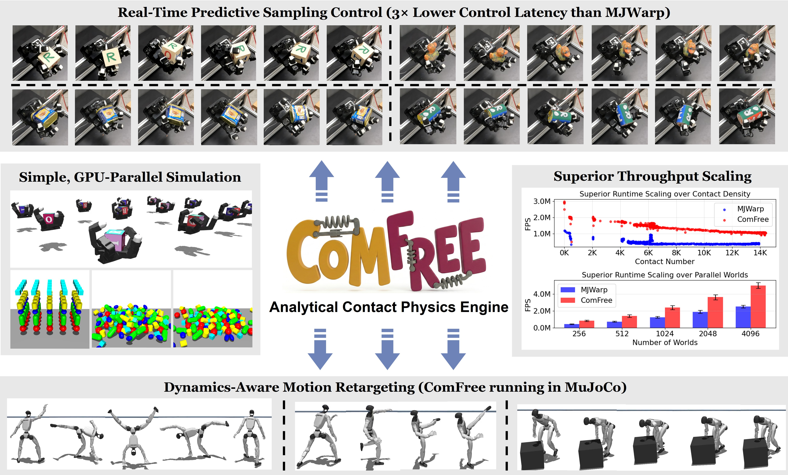

# ComFree-Sim: GPU-Parallelized Analytical Contact Physics Engine



ComFree-Sim is a GPU-parallelized analytical contact physics engine designed for scalable contact-rich robotics simulation and control. This engine provides efficient simulation of complex interaction dynamics while exploiting modern GPU hardware for significant computational speedup.

## Overview

ComFree-Sim enables fast and accurate simulation of robots interacting with their environment through contacts. The engine supports large-scale parallel simulations, making it ideal for:

- Contact-rich robotics tasks (manipulation, locomotion, etc.)
- Multi-environment parallel simulation
- GPU-accelerated physics simulation
- Scalable simulation pipelines for learning and control

## Resources

- **Project Website**: https://irislab.tech/comfree-sim/
- **Documentation**: https://irislab.tech/comfree-doc/intro.html
- **Paper (arXiv)**: https://arxiv.org/abs/2603.12185

## Installation

Install the package using pip:

```bash
pip install .
```

Or with UV package manager:

```bash
uv sync
```


## Quick Start

### Local Viewer Simulation

Run an interactive simulation with the native MuJoCo viewer:

```bash
python test_local/test_viewer.py
```

This script loads a test scene and displays the simulation in real time using the built-in MuJoCo viewer. You can modify the `engine` variable (`0=MJC`, `1=MJWARP`, `2=COMFREE_WARP`) to compare different simulation backends directly on a local machine. You can also switch `model_path` in [test_viewer.py](/home/wjin/Research/comfree/comfree_warp/test_local/test_viewer.py) to try other XML scenes such as `benchmark/humanoid/n_humanoid.xml`, `benchmark/test_data/collision.xml`, `benchmark/test_data/flex/floppy.xml`, `benchmark/test_data/hfield/hfield.xml`, and `benchmark/leap/env_leap_cube.xml`.

### Local Franka Grasp Test

Run the Franka cube-grasp benchmark locally:

```bash
python test_local/test_franka_grasp.py
```

Available backends are `mujoco`, `mjwarp`, and `comfree`.

### Throughput Benchmarking

Run a throughput benchmark with parallel hand simulation:

```bash
python test_local/test_throuput_hand.py
```

This script evaluates the performance of different engines with parallel environments. It benchmarks:
- Mujoco in Warp
- ComFree-Sim contact physics in Warp

Results include throughput metrics and step time statistics across multiple parallel environments.

### Headless Streaming Simulation

Run a headless simulation and stream state to a local viewer:

```bash
python test_headless/test_streaming.py
```

By default this waits for a viewer connection on `MJSTREAM_PORT=7000` and streams the MuJoCo state over TCP.
Like the local viewer test, you can change the `engine` setting in [test_streaming.py](/home/wjin/Research/comfree/comfree_warp/test_headless/test_streaming.py) (`0=MJC`, `1=MJWARP`, `2=COMFREE_WARP`) and switch `model_path` to try other XML scenes such as `benchmark/humanoid/n_humanoid.xml`, `benchmark/test_data/collision.xml`, `benchmark/test_data/flex/floppy.xml`, `benchmark/test_data/hfield/hfield.xml`, and `benchmark/leap/env_leap_cube.xml`.

### Headless Franka Grasp Streaming

Run the Franka grasp benchmark headlessly and stream it to the viewer:

```bash
python test_headless/test_franka_grasp.py
```

You can override the stream endpoint with `MJSTREAM_HOST` and `MJSTREAM_PORT`.
This benchmark also supports multiple backends through `--engine` with `mujoco`, `mjwarp`, or `comfree`.


### Python API

```python
import comfree_warp as cf_warp

# Create your simulation environment
# See documentation for detailed examples
```

For comprehensive examples and tutorials, visit the [documentation](https://irislab.tech/comfree-doc/intro.html).

## License

See LICENSE file for details.

## Citation

If you use ComFree-Sim in your research, please cite:

```bibtex
@article{borse2026comfree,
  title={ComFree-Sim: A GPU-Parallelized Analytical Contact Physics Engine for Scalable Contact-Rich Robotics Simulation and Control},
  author={Borse, Chetan and Xie, Zhixian and Huang, Wei-Cheng and Jin, Wanxin},
  journal={arXiv preprint arXiv:2603.12185},
  year={2026}
}
```
