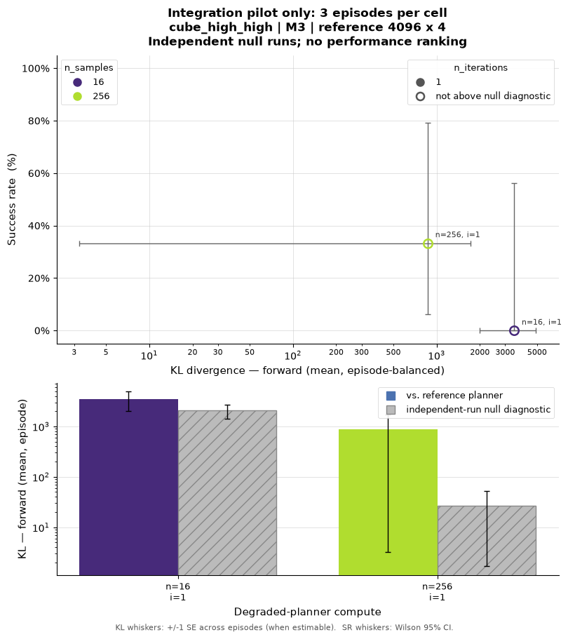
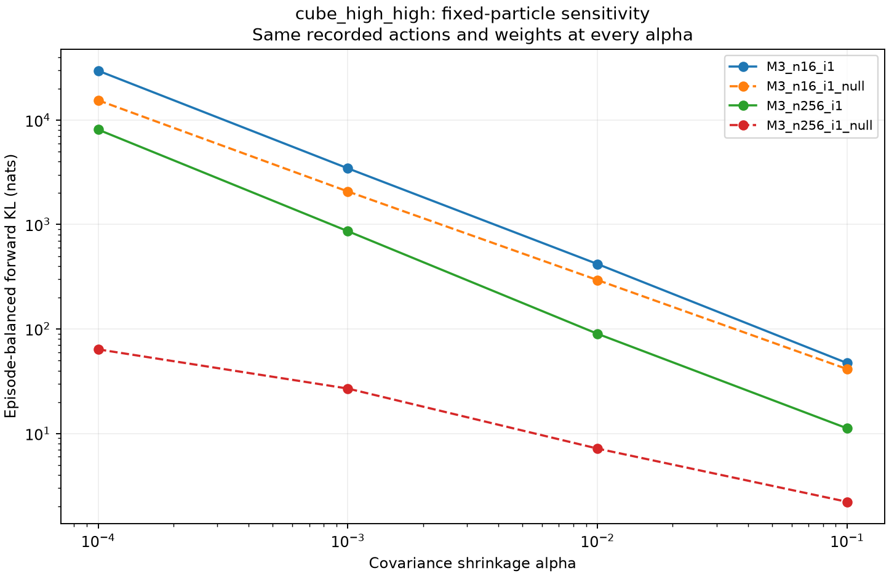

# KL workflow delivery validation

Date: 2026-09-07. Branch: `kl_divergence_analysis`.

This validation concerns the reusable KL-versus-success workflow and its
numerical interpretation. The local pilot is a small integration example,
not evidence that KL predicts success or that one compute budget is superior.

## Changes

- The KL worker's scientific defaults now match the cluster template: M3,
  high/high geometry, difficulty 1, requested horizon 0.352 s, control period
  0.064 s, temperature 1.0 and proposal sigma 0.025. Sample counts and episode
  counts remain explicit grid axes and workload settings.
- The final allowed command is now followed by success/drop classification.
  Previously, an episode satisfying a terminal condition on that command
  could be labelled timeout. `config.kl_protocol` distinguishes the corrected
  scoring rule from older records, and the plotter keeps those protocols apart.
- Optional `--record_kl_moments` saves both planners' raw weighted first-action
  means and covariance matrices at valid KL measurements. No new candidates
  are drawn, and the default estimator is unchanged.
- A CPU sensitivity tool verifies saved-KL reproduction before recomputing KL
  over a specified shrinkage grid on those same moments.
- A short GPU shadow audit checks equal paired inputs, pre-solve means,
  separate mutable buffers, environment RNG consumption and sampling counters.
- The console now distinguishes the episode-mean headline used by the default
  figure from the legacy pooled-step summary retained in the JSON.
- The English workflow guide includes reproduction commands and interpretation
  limits. The MuJoCo-Warp collision iteration limit remains 35.

## Local environment

The GPU is an NVIDIA GeForce RTX 5070 Ti with 16 GB VRAM, driver 595.84.
Python 3.12.3, MuJoCo 3.6.0, Warp 1.12.0, NumPy 2.5.2 and Pinocchio 4.1.0
were used. These measurements are local; they are not RTX 5090 or cluster
benchmarks. Synchronous simulation does not establish real-time feasibility.

## Shadow isolation and repeated processes

Four independent processes ran one eight-command `cube_high_high` episode
each. Two used a real `16 x 1` versus `4096 x 4` comparison; two used null
`16 x 1` versus `16 x 1`. Root seed was 20260907 and KL was measured every
command. The other settings matched the recommended protocol.

All four audits passed their exact-equality assertions. In each measured
comparison, both planners received the same qpos, qvel, previous control, goal
and pre-solve sequence mean. Planner construction and planning did not consume
the environment random stream. Explicit degraded arrays and sampling counters
were unchanged by the shadow solve. Model/data objects and the audited mutable
arrays were separate. The audit checked 64 planner calls and produced 32 finite
KL comparisons, with no invalid KL.

Cross-process repeatability was nevertheless not exact:

| Pair | Initial state/goal/control | Degraded noise at all eight calls | Maximum first-action component difference at step 0 |
|---|---|---|---:|
| Real repeat 1 / repeat 2 | Identical | Identical | 1.050e-6 rad |
| Null repeat 1 / repeat 2 | Identical | Identical | 1.042e-6 rad |
| Real repeat 1 / null repeat 1 | Identical | Identical | 1.937e-6 rad |

These first-action differences appeared before the first shadow solve. They
therefore cannot be explained by an earlier shadow solve changing an applied
action in that episode, or by different candidate noise. This localizes the
earliest observable discrepancy to the degraded planning calculation. It does
not identify a specific GPU reduction, collision algorithm or backend-private
state as the cause.

Closed-loop evolution amplified the discrepancy. At the input to control
step 7, the two real repeats' object-position separation was approximately
0.0105 mm; the two null repeats' separation was 1.483 mm and their
object-orientation difference was 0.0351 rad. These are illustrative
repeated-process diagnostics, not
independent success-rate trials. Passing the array checks is not a guarantee
of full backend isolation or deterministic dynamics.

## Fixed-particle regularization check

Raw moments from real repeat 1's eight audited states reproduced the recorded
forward and reverse KL exactly at the original alpha. Holding every candidate,
weight, state and optimized mean fixed gave:

| Shrinkage alpha | Mean forward KL over the eight states |
|---:|---:|
| 0.0001 | 71034.13 |
| 0.001 | 7126.76 |
| 0.01 | 724.31 |
| 0.1 | 67.96 |

The degraded raw covariance rank ranged from 0 to 14 (maximum possible 15 for
16 centered samples in 16 dimensions). ESS ranged from 1.0 to 11.72, with mean
4.30. Mean Euclidean first-action displacement was 0.0779 rad. Alpha was not
changed for the control experiments; it remains 0.001. This substantial
sensitivity shows why a large scalar KL cannot be read as a proportional
planner-quality gap. It is a property of the Gaussian estimator applied to
these weighted samples, and does not by itself assess reference optimality.

## Complete-episode high/high pilot

Four cells ran three episodes each using M3, cube high/high, Pinocchio,
the normal 1000-command maximum, and KL every 20 commands. Real comparisons
used a 4096 x 4 reference; null remained an independent closed-loop run at
the degraded compute. All 12 episodes completed their normal termination
rule. The 459 KL measurements were finite, with zero invalid measurements.

| Degraded compute | Run | Successes | End reasons | Episode-balanced forward KL +/- SE | Mean degraded plan time |
|---|---|---:|---|---:|---:|
| 16 x 1 | Real | 0/3 | 3 timeout | 3449.58 +/- 1448.91 | 28.5 ms |
| 16 x 1 | Null | 0/3 | 2 timeout, 1 drop | 2071.95 +/- 636.35 | 28.5 ms |
| 256 x 1 | Real | 1/3 | 1 success, 1 timeout, 1 drop | 863.41 +/- 860.15 | 36.2 ms |
| 256 x 1 | Null | 2/3 | 2 success, 1 timeout | 26.90 +/- 25.22 | 39.3 ms |

The high-compute reference averaged 435.0 ms/measurement in the 16 x 1 real
cell and 434.5 ms in the 256 x 1 real cell. The table's degraded times average
the three episode means. The real 256 x 1 success occurred at command 307;
the two null 256 x 1 successes occurred at commands 812 and 676. The real
drop occurred at command 121 and the null 16 x 1 drop at command 207.

The real 256 x 1 episode KL means were 2583.70, 2.27 and 4.25. The short,
failed episode therefore has a large effect on the episode-balanced mean
and its SE. A pooled-step mean would instead be 250.24; the 863.41 figure
gives each episode equal weight. Both definitions remain traceable in the
result files; they should not be interchanged.

At three episodes, 0/3 and 1/3 successes have broad Wilson 95% intervals
(approximately 0-56% and 6-79%, respectively). These observations do not
rank the budgets or establish a KL-success relationship. Independent real/null
trajectories also differ, so their KL values are not an additive noise
decomposition. Hollow scatter markers use a descriptive mean/SE comparison,
not a significance test.



## Sensitivity on all pilot measurements

The CPU tool reproduced all 459 saved forward/reverse KL pairs with zero
absolute discrepancy at alpha=0.001. Episode-balanced forward means on the
same fixed weighted moments were:

| Run | alpha=0.0001 | alpha=0.001 | alpha=0.01 | alpha=0.1 |
|---|---:|---:|---:|---:|
| 16 x 1 real | 29667.18 | 3449.58 | 418.58 | 47.14 |
| 16 x 1 null | 15469.27 | 2071.95 | 293.99 | 41.31 |
| 256 x 1 real | 8096.87 | 863.41 | 89.93 | 11.19 |
| 256 x 1 null | 63.83 | 26.90 | 7.17 | 2.22 |

The 256 x 1 real raw covariances all had numerical rank 16, but ESS ranged
from 1.29 to 202.57. Full rank alone did not remove shrinkage sensitivity.
Large KL should therefore be reported together with this sensitivity and
weight-concentration information, not as a parameter-independent measure of
planner quality. Alpha was not tuned or changed for the control runs.



## Reproduction and local artifacts

The focused CPU suite passed 72 tests. Coverage includes Gaussian arithmetic,
saved-moment reproduction, terminal success/drop/timeout classification,
equal planner inputs and degraded-only control, scientific default agreement,
all-object scene interfaces, incompatible-family separation, duplicate seed
protection and plotting output. Shell syntax and all 80 dry-run commands were
checked; the template represents 2400 planned episodes and was not submitted.

```bash
python -m pytest -q tests/test_kl_analysis.py tests/test_kl_worker_config.py \
    tests/test_kl_plot_grouping.py tests/test_kl_scene_assets.py tests/test_kl_delivery.py
```

The public entry points and commands are documented in
[`README_kl_divergence.md`](README_kl_divergence.md). Local raw outputs and
logs live under `results/kl_delivery_20260907/`; that directory is ignored by
Git. `execution_manifest.json` records the actual bounded subprocess commands
and their exit status. Repeated audits are kept apart from independent pilot
cells to prevent duplicated seeds from inflating plotted evidence.

No cluster sweep or remote publication is part of this validation.

The deliverable plotting example is under
[`examples/kl_cube_high_high_20260907/`](examples/kl_cube_high_high_20260907/README.md).
It includes four compact cell JSONs, the pilot PNG/PDF, and the sensitivity
figure/summary. Its JSONs retain original scalar KL, episode outcomes, seeds,
timings and settings; they explicitly omit the large raw-moment blocks and
retain source SHA-256 digests. The ordinary plotting CLI was verified against
these compact files on CPU. They reproduce the same two real points and two
null partners; no simulation rerun is needed to draw them.

The code and example are ready for collaborator review as an experiment and
diagnostic tool. Before a large scientific sweep, the interpretation of
regularization-sensitive Gaussian KL and the chosen reference budget should
be settled. The requested independent-null design and collision limit of 35
remain intact. Backend-level repeatability is still a reported limitation.
