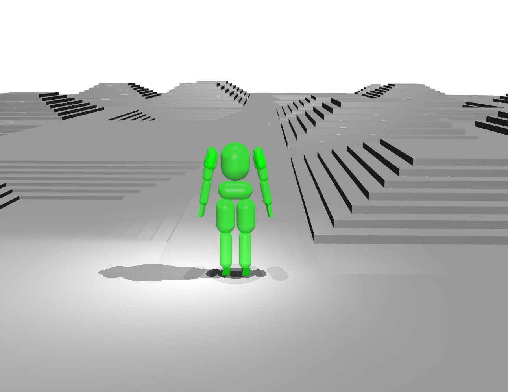

# Apptronik Apollo Large Terrain

  

## Overview
Collisions-only version of Apollo humanoid for physics benchmarking.

This box-only terrain is a 10x20 grid of subterrains. The subterrains are roughly 45% upright pyramids, 45% inverted pyramids and 10% flat. The pyramids have random step heights.

## Derivation Steps
The apollo XML is from `contrib/xml/apptronik_apollo.xml`([source](https://github.com/google-deepmind/mujoco_warp/blob/8b26735a3ab3602cee898cfb002f609c38137b36/contrib/xml/apptronik_apollo.xml)) but without visual assets.

Apart from the additional geoms, `scene_terrain.xml` differs from the original `scene.xml` in a few settings for stabler simulation:
1. Uses `<flag eulerdamp="disable" />`
2. `iterations`: `2` -> `10`
3. `ls_iterations`: `10` -> `20`
