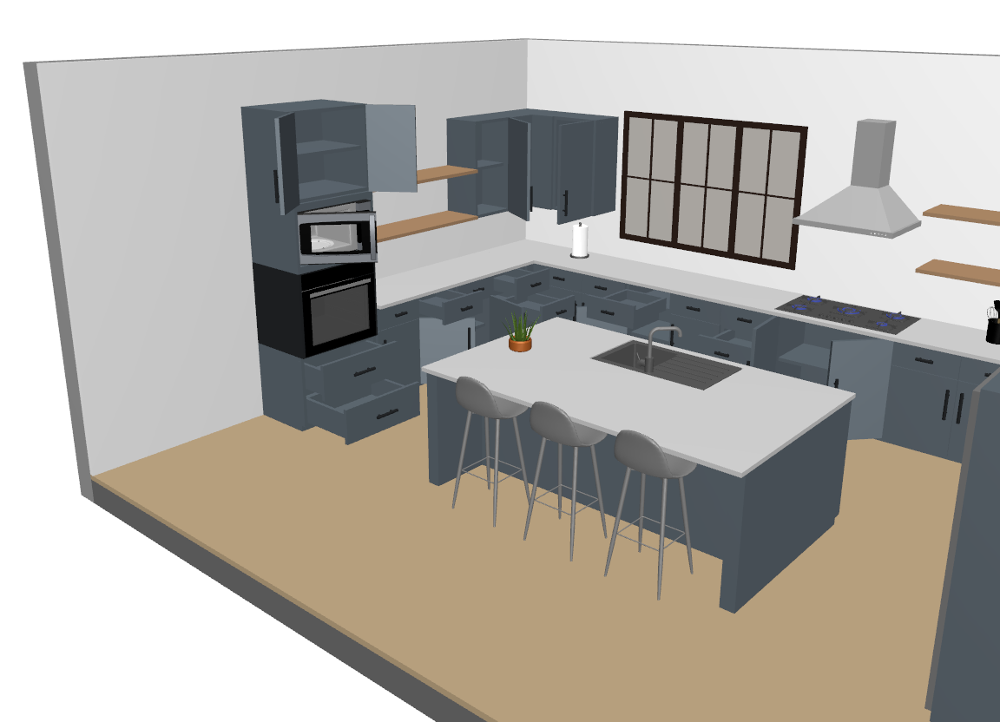
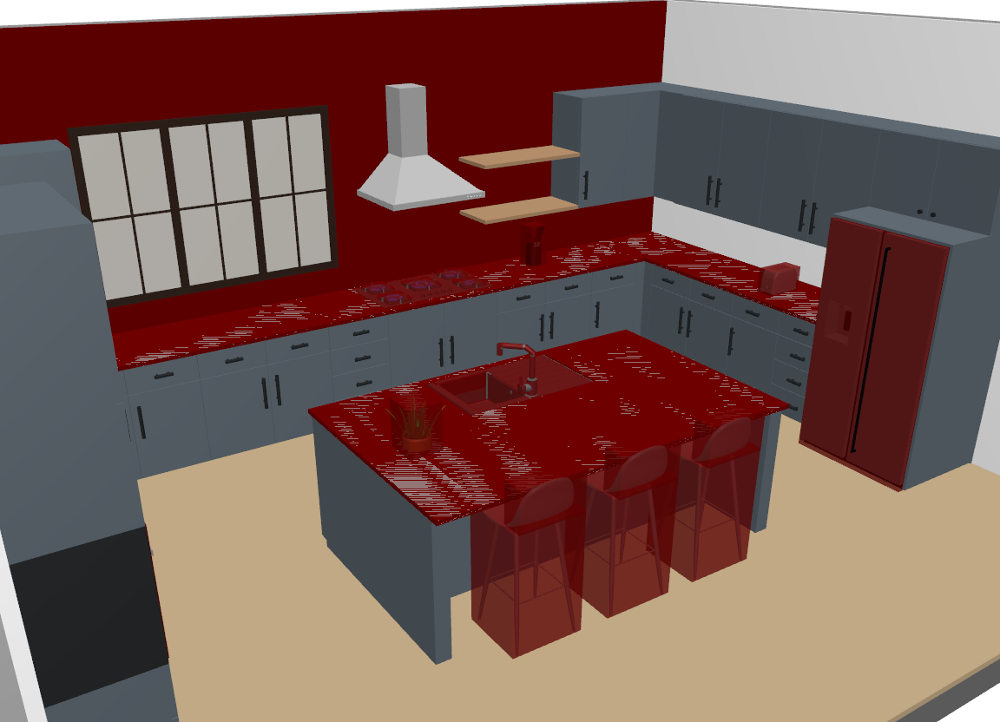

# Kitchen Environment Description (MJCF)

## Changelog

See [CHANGELOG.md](./CHANGELOG.md) for a full history of changes.

## Overview

This package contains a simplified description (MJCF) of a kitchen environment inspired by [Robocasa](https://github.com/robocasa/robocasa).
Most elements in the scene are movable and can be interacted with, making the environment suitable for manipulation tasks.

  
  

## Creation steps

1. Several kitchen environment xml files were generated using [Robocasa](https://github.com/robocasa/robocasa).
2. One file was selected as a reference, while others were used to swap furnitures.
3. The following manual edits were applied to the reference file:
  1. All duplicate textures and materials were merged.
  2. Textures were replaced by uniform colors closely matching the original appearance.
  3. Some furniture items were swapped for equivalent alternatives.
  4. Normals and UV coordinate information were removed from meshes.
  5. Some meshes were slightly modified to reduce their size (see subfolders in `assets` for more details).
  6. Certain objects were removed to lighten the scene without reducing its overall complexity.
  7. A new (lighter) stool (not present in [Robocasa](https://github.com/robocasa/robocasa)) was added along with simple collision meshes.

## License

The xml file of the model is released under a [MIT License](LICENSE).
Licenses for individual objects composing the scene are provided in their respective subfolders within `assets/`.
